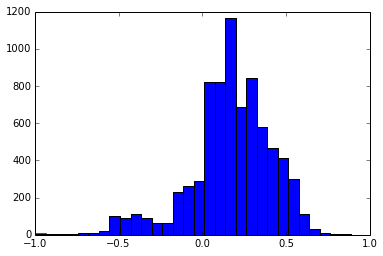

# Data

This notebook explains how we collected data for this project. The environment
variable `$TWNEWS_DATA` is used throughout for the directory to read/write data.
We set it to `/data/twnews`.

## Scoring URLs by political bias

<http://balancestudy.org> is a project to score news sites by their political
leanings. A large positive score indicates a liberal site, a large negative
score indicates a conservative site.


    % pylab inline
    import numpy as np
    import twnews.balance as balance

    Populating the interactive namespace from numpy and matplotlib


    # We first fetch the scores from balancestudy.org and write to a text file.
    balance.fetch_balance_scores()


    # Next, we read the text file into a Python dict
    url_scores = balance.load_balance_scores()


    # Let's see the top 5 conservative and liberal sites.
    sorted_scores = sorted(url_scores.items(), key=lambda x: x[1])
    print 'conservative:\n', '\n'.join(['%s\t%f' % (u, s) for u, s in sorted_scores[:5]])
    print 'liberal:\n', '\n'.join(['%s\t%f' % (u, s) for u, s in sorted_scores[::-1][:5:]])

    conservative:
    http://billoreilly.com	-0.993479
    http://rushlimbaugh.com	-0.987333
    http://glennbeck.com	-0.968680
    http://weaselzippers.us	-0.953369
    http://humanevents.com	-0.946453
    liberal:
    http://washingtonmonthly.com	0.890282
    http://thinkprogress.org	0.885619
    http://thecarpetbaggerreport.com	0.873459
    http://downwithtyranny.blogspot.com	0.834248
    http://brianbeutler.com	0.782582


    # Let's print some statistics of these scores.
    scores = url_scores.values()
    fig = hist(scores, 30)
    print 'n=%d mean=%.3f std=%.3f' % (len(scores), np.mean(scores), np.std(scores))

    n=7619 mean=0.167 std=0.244





Looks like a liberal skew.

## Collecting tweets mentioning certain URLs

Next, we need a sample of tweets that link to one of the URLs in our dataset.

One possible problem is the extensive use of URL shorteners on Twitter (e.g.,
<http://bit.ly>). Fortunately, the Twitter REST API by default searches the
expanded URL. So, consider [this
tweet](https://twitter.com/JohnGaltTx/status/454061949135769601). The url
<http://urbangrounds.com/2013/04/art-acevedo-puppet/> has been shortened to
<http://goo.gl/dkzwV>. Even though the term "urbangrounds.com" does not appear
anywhere in the tweet (nor in the json object returned), the [Twitter Search
API](https://dev.twitter.com/docs/api/1.1/get/search/tweets) returns this tweet.

To collect similar such tweets, we iteratively submit each URL as a search
query, storing up to 100 results per query. We loop infinitely, sleeping when we
hit the Twitter rate limit.

To launch the collection script, you'll need to first set environmental
variables for your Twitter OAuth credentials. In a bash environment, this would
be like:

```bash
export TW_CONSUMER_KEY=aaa
export TW_CONSUMER_SECRET=bbb
export TW_ACCESS_TOKEN=ccc
export TW_ACCESS_TOKEN_SECRET=ddd
```

Then, you can run:

`python -u -m twnews.search_url_tweets`

(If you haven't installed `twutil`, do so with `pip install twutil`).

In order to make our results reproducible, we will provide a list of tweet IDs
included in our study, which one can then use the Twitter API to download.

**TODO:** This process will return many tweets from the official account for an
organization (e.g., `SeriouslyOMGWTF` is the top user tweeting links to
<http://seriouslyomg.com>). We can filter these by removing the top *k* most
popular screen names per URL.
